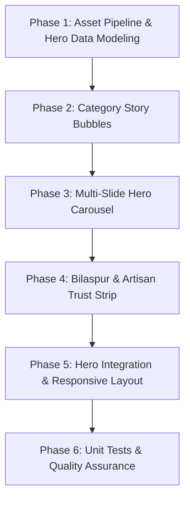

# Implementation Plan: Hero Section Redesign (Hybrid Concept A)

## 📌 Executive Summary
This plan details the complete redesign of the Meadow Mist customer storefront Hero section, transitioning from an editorial single-product display into a **high-converting, D2C luxury hybrid experience** inspired by Myntra Luxe and Flipkart, optimized specifically for a newly launched handcrafted candle and ceramic business operating from **Bilaspur, Chhattisgarh**.

---

## 🎨 Design System & Token Mappings

| Element | Meadow Mist Token | Value / Aesthetic Purpose |
|---|---|---|
| Background Canvas | `var(--color-canvas)` | `#F7F2E7` (Warm artisan parchment) |
| Alternate Surface | `var(--color-surface)` | `#FFFFFF` (Crisp container background) |
| Border & Divider | `var(--color-gold-soft)` | `#D9C08F` (Subtle antique gold borders) |
| Primary Accent / Text | `var(--color-forest)` | `#33422A` (Deep forest typography) |
| Highlight / Glow | `var(--color-gold)` | `#B4903F` (Active indicators, CTAs, tags) |
| Display Typography | `var(--font-display)` | `'Fraunces', Georgia, serif` |
| Body Typography | `var(--font-body)` | `'Jost', system-ui, sans-serif` |
| Card / Bubble Shadow | `var(--shadow-card)` | `0 12px 24px -8px rgba(51, 66, 42, 0.18)` |
| Corner Radii | `var(--radius-full)`, `var(--radius-lg)` | 9999px (bubbles, pills) / 24px (carousel cards) |

---

## 🖼️ Assets Required & Strategy

### 1. Category Story Bubbles (5 Square / Circular 1:1 Images)
Path: `apps/storefront/public/images/hero/bubbles/`
* **`bubble-candles.jpg`** — Scented Soy Pillars & Sculptural Candles
  * *Source*: Based on `/images/products/ivory-pillar-floral-candle.jpg` / `/images/products/rose-tower-candle.jpg`
  * *Target route*: `/candles`
* **`bubble-lotus.jpg`** — Signature Lotus Bowls & Tealight Holders
  * *Source*: Based on `/images/products/black-gold-lotus-tealight.jpg` / `/images/products/lotus-bowl-blush.jpg`
  * *Target route*: `/ceramics`
* **`bubble-trinket.jpg`** — Wheel-Thrown Trinket & Jewelry Boxes
  * *Source*: Based on `/images/products/daisy-trinket-box-blue.jpg` / `/images/products/ivory-ribbed-trinket-box.jpg`
  * *Target route*: `/ceramics`
* **`bubble-wax-discs.jpg`** — Botanical Wax Clusters & Scented Discs
  * *Source*: Based on `/images/products/sunflower-wax-disc-gold.jpg` / `/images/products/chocolate-floral-wax-cluster.jpg`
  * *Target route*: `/candles`
* **`bubble-gifting.jpg`** — Curated Gift Sets & Festival Hampers
  * *Source*: Curated artisan gift bundle imagery
  * *Target route*: `/candles`

### 2. Multi-Slide Hero Carousel Banners (3 Wide 16:9 / 21:9 Panoramic Images)
Path: `apps/storefront/public/images/hero/banners/`
* **Banner 1 (`banner-bilaspur-studio.jpg`)**:
  * *Theme*: *"Handcrafted in Bilaspur, Poured with Intention"*
  * *Visual*: High-resolution artisan workshop tablescape featuring botanical pillar candles, glowing lotus tealights, warm dried lavender, and gold accents on textured linen.
  * *Headline*: *"Things made by hand, grown like something living."*
  * *Subtext*: *"Small-batch soy candles & wheel-thrown ceramics crafted with botanical intention in Bilaspur."*
  * *CTAs*: `Shop Candles` (primary gold) + `Explore Ceramics` (secondary outline).
* **Banner 2 (`banner-lotus-collection.jpg`)**:
  * *Theme*: *"The Signature Lotus Tealight Collection"*
  * *Visual*: Dramatic warm golden ambient lighting on hand-glazed black & gold ceramic lotus bowls with dancing candlelight reflections.
  * *Headline*: *"Sacred Glow, Wheel-Thrown Form."*
  * *Subtext*: *"Signature heirloom ceramics finished with 24k luster details and soy tea lights."*
  * *CTAs*: `Discover Lotus Bowls` + `View Ceramic Décor`.
* **Banner 3 (`banner-festive-gifting.jpg`)**:
  * *Theme*: *"Artisan Gifting & Fast Doorstep Delivery in Bilaspur"*
  * *Visual*: Elegant kraft gift hamper packed with cotton crinkle, botanical wax discs, ribbed candle, ceramic trinket box, and dried florals with handwritten tags.
  * *Headline*: *"Gifts that Feel Warm, Personal & Lasting."*
  * *Subtext*: *"Custom gift boxing and express local delivery across Bilaspur & Chhattisgarh."*
  * *CTAs*: `Shop Gift Hampers` + `Contact for Bulk Gifting`.

### 3. Trust & Assurance Icons (4 Curated Vector SVG Badges)
* 🚀 **Bilaspur Express Delivery**: Same-day & 24h local doorstep delivery within Bilaspur; regional Chhattisgarh tracking.
* 🍃 **100% Pure Soy Wax**: Clean burning, petroleum/paraffin-free, lead-free cotton wicks.
* 🏺 **Studio Handcrafted**: Wheel-thrown in small batches, no two pieces identical.
* 🛡️ **Zero-Breakage Guarantee**: Triple-cushioned eco-friendly packaging for fragile ceramic ware.

---

## 🗓️ Phases, Tasks & Git Commits



### Phase 1: Asset Pipeline & Hero Data Modeling

#### Task 1.1: Prepare Hero Banners and Story Bubble Assets
* **Objective**: Generate and place high-definition banner images and category bubble thumbnails in `apps/storefront/public/images/hero/`.
* **Files**:
  * `apps/storefront/public/images/hero/banners/banner-bilaspur-studio.jpg` (new)
  * `apps/storefront/public/images/hero/banners/banner-lotus-collection.jpg` (new)
  * `apps/storefront/public/images/hero/banners/banner-festive-gifting.jpg` (new)
  * `apps/storefront/public/images/hero/bubbles/` (5 thumbnails)
* **Git Commit**:
  ```bash
  git commit -m "chore(storefront): add high-resolution hero banners and story bubble assets"
  ```

#### Task 1.2: Define Typed Hero Configuration Data
* **Objective**: Create `apps/storefront/src/data/heroData.ts` containing strongly typed arrays for slides, story bubbles, and trust badges with zero comments.
* **Files**:
  * `apps/storefront/src/data/heroData.ts` (new)
* **Git Commit**:
  ```bash
  git commit -m "feat(storefront): create typed hero configuration data model"
  ```

---

### Phase 2: Category Story Circles Component (`CategoryStoryBubbles`)

#### Task 2.1: Build `CategoryStoryBubbles` Component
* **Objective**: Create an Instagram / Myntra style horizontal row of circular image bubbles with gold active/hover ring animations.
* **Implementation Details**:
  * `apps/storefront/src/components/Hero/CategoryStoryBubbles.tsx` and `.module.css`.
  * Desktop: Centered flex row with subtle hover lift and gold ring expansion.
  * Mobile: Horizontal touch-swipeable momentum scroll container (`overflow-x: auto; scroll-snap-type: x mandatory`).
  * Circular thumbnail with organic border (`border: 2px solid var(--color-gold-soft)`).
  * Category label in `var(--font-body)` uppercase caption.
  * Strictly zero comments in code files.
* **Files**:
  * `apps/storefront/src/components/Hero/CategoryStoryBubbles.tsx` (new)
  * `apps/storefront/src/components/Hero/CategoryStoryBubbles.module.css` (new)
* **Git Commit**:
  ```bash
  git commit -m "feat(storefront): implement category story bubbles with touch momentum scroll"
  ```

---

### Phase 3: Multi-Slide Hero Carousel (`HeroCarousel`)

#### Task 3.1: Build Responsive Banner Carousel
* **Objective**: Create an auto-playing, swipeable, full-fidelity hero carousel with accessible controls and smooth slide transitions.
* **Implementation Details**:
  * `apps/storefront/src/components/Hero/HeroCarousel.tsx` and `.module.css`.
  * Auto-advance timer (5.5s) with pause on hover/touch.
  * Mobile touch swipe gesture support (`onTouchStart`, `onTouchMove`, `onTouchEnd`).
  * Carousel slide controls:
    * Left / Right chevron buttons with frosted backdrop (`rgba(247, 242, 231, 0.8)`).
    * Dynamic dot pill indicators with active gold fill bar.
  * Slide content overlay:
    * Curated badge / eyebrow pill.
    * Serif headline with *Fraunces* italic script accent.
    * Descriptive subtext.
    * Primary & Secondary action buttons.
  * Strictly zero comments in code files.
* **Files**:
  * `apps/storefront/src/components/Hero/HeroCarousel.tsx` (new)
  * `apps/storefront/src/components/Hero/HeroCarousel.module.css` (new)
* **Git Commit**:
  ```bash
  git commit -m "feat(storefront): build multi-slide hero carousel with touch swipe and auto-play"
  ```

---

### Phase 4: Local & Artisan Trust Strip (`HeroTrustStrip`)

#### Task 4.1: Build Bilaspur Delivery & Artisan Guarantee Strip
* **Objective**: Create a conversion-boosting trust badge strip directly below the hero carousel.
* **Implementation Details**:
  * `apps/storefront/src/components/Hero/HeroTrustStrip.tsx` and `.module.css`.
  * 4 items:
    1. 🚀 **Bilaspur Express**: *"Same-day / 24h delivery within Bilaspur"*
    2. 🍃 **100% Pure Soy Wax**: *"Clean burning & non-toxic botanical oils"*
    3. 🏺 **Artisan Crafted**: *"Wheel-thrown & poured in small batches"*
    4. 🛡️ **Ceramic Guarantee**: *"Zero-breakage secure eco packaging"*
  * High-density horizontal grid on desktop; swipeable or 2x2 grid on mobile.
  * Strictly zero comments in code files.
* **Files**:
  * `apps/storefront/src/components/Hero/HeroTrustStrip.tsx` (new)
  * `apps/storefront/src/components/Hero/HeroTrustStrip.module.css` (new)
* **Git Commit**:
  ```bash
  git commit -m "feat(storefront): add Bilaspur delivery and artisan trust assurance strip"
  ```

---

### Phase 5: Hero Integration & Responsive Orchestration

#### Task 5.1: Refactor Main `Hero.tsx` Component
* **Objective**: Assemble `CategoryStoryBubbles`, `HeroCarousel`, and `HeroTrustStrip` into the unified `Hero` component.
* **Implementation Details**:
  * Update `apps/storefront/src/components/Hero/Hero.tsx` and `Hero.module.css`.
  * Ensure smooth layout hierarchy:
    1. Top: Quick-Shop Category Story Bubbles
    2. Center: Cinematic 3-Slide Hero Carousel
    3. Bottom: Local Bilaspur & Craft Trust Strip
  * Zero layout shift and responsive breakpoints for mobile, tablet, and widescreen.
  * Strictly zero comments in code files.
* **Files**:
  * `apps/storefront/src/components/Hero/Hero.tsx`
  * `apps/storefront/src/components/Hero/Hero.module.css`
* **Git Commit**:
  ```bash
  git commit -m "refactor(storefront): orchestrate hybrid hero experience with carousel and bubbles"
  ```

---

### Phase 6: Automated Testing & Verification

#### Task 6.1: Unit Test Suite for Hero Components
* **Objective**: Write comprehensive Vitest unit tests covering slide rotation, touch swipe, category bubble rendering, and trust strip assertions.
* **Implementation Details**:
  * `apps/storefront/src/components/Hero/Hero.test.tsx`
  * Test slide cycling, manual next/previous navigation, bubble click routing, and accessibility attributes.
  * Strictly zero comments in code files.
* **Files**:
  * `apps/storefront/src/components/Hero/Hero.test.tsx` (new)
* **Git Commit**:
  ```bash
  git commit -m "test(storefront): add unit tests for hero carousel, story bubbles, and trust strip"
  ```

#### Task 6.2: Full Monorepo Typecheck & Test Suite Run
* **Objective**: Validate that all unit tests pass (100% success rate) and `npm run typecheck` passes with zero errors.
* **Verification Command**:
  ```bash
  npm test && npm run typecheck
  ```
